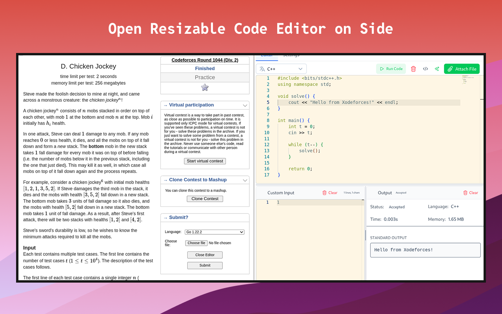

# Xodeforces

<div align="center">
  
  <h1>Xodeforces</h1>
  <p>A powerful browser extension that transforms your competitive programming experience on Codeforces with an integrated Monaco editor, code execution, and smart features.</p>
  
  [](https://opensource.org/licenses/MIT)
  
  [](https://chromewebstore.google.com/detail/xodeforces/lnfgjljnmoickkgbjedecbkcmhhdncpk)
  
  <p>🚀 Available for Chrome • 🦊 Firefox Support</p>
  
    
  *Xodeforces enhancing the Codeforces experience*
</div>

> [!WARNING]
> Firefox has a limit to file sizes of 5MB. That's why the Firefox version of Xodeforces is not available in Firefox Addon Store. You can install it from the [releases](https://github.com/Prastavna/xodeforces/releases/) page
> We are waiting for this PR to be merged: [PR](https://github.com/mozilla/addons-linter/pull/5765)

## ✨ Key Features

### 🚀 **Judge0 Code Execution**
- **Real-time Testing**: Execute code with custom inputs using Judge0 API
- **Multi-language Support**: Run code in multiple programming languages
- **Status Tracking**: Real-time execution status and detailed error reporting
- **Custom Test Cases**: Test your solutions before submitting

### 🖥️ **Advanced Code Editor**
- **Monaco Editor**: Full VS Code editor experience in your browser
- **IntelliSense**: Language-specific auto-completion and hover information
- **Advanced Editing**: Multi-cursor support, code folding, bracket matching
- **Keybindings**: Familiar VS Code shortcuts and commands

### 🎨 **Rich Customization**
- **10+ Themes**: From GitHub to Dracula, Monokai to Nord
- **Font Customization**: Adjust family, size, and line spacing
- **Layout Control**: Resizable panels, tab configuration
- **Persistent Settings**: All preferences saved across sessions

### ⚡ **Competitive Programming Tools**
- **Smart Templates**: Language-specific competitive programming boilerplates
- **Code Snippets**: Save and manage reusable code snippets
- **Problem Integration**: Seamless integration with Codeforces problem pages
- **Auto-save**: Never lose your progress with automatic code persistence

## 📦 Installation

### Chrome Extension
1. **Install from Chrome Web Store**: [Download Xodeforces](https://chromewebstore.google.com/detail/xodeforces/lnfgjljnmoickkgbjedecbkcmhhdncpk)
2. **Visit Codeforces**: Navigate to any problem page on [codeforces.com](https://codeforces.com)
3. **Start Coding**: The editor appears automatically below the problem statement

### Firefox Add-on
1. **Download**: Get the latest `.xpi` from our [releases page](https://github.com/prastavna/xodeforces/releases)
2. **Install**: Open `about:addons` → Settings gear → "Install Add-on From File"
3. **Activate**: Visit any Codeforces problem to start using the editor

## 🏃‍♂️ Quick Start

1. **Configure Judge0** (Optional): Go to settings page to set up code execution
2. **Choose Your Language**: Select from the dropdown in the editor
3. **Use Templates**: Click "Template" to load competitive programming boilerplate
4. **Write & Test**: Code in the editor, test with custom inputs
5. **Submit**: Copy your solution or submit directly through Codeforces

## 🔐 How to setup Judge0 Key
1. Start a free plan of [Judge0 Api](https://rapidapi.com/judge0-official/api/judge0-ce/playground/apiendpoint_489fe32c-7191-4db3-b337-77d0d3932807)
2. Get the api key from the playground. And add it to the Judge0 settings.
3. Test Connection to make sure you have setup the key properly.

## 🛠️ Development

### Prerequisites
- [Bun](https://bun.sh/) v1.2.19+

### Quick Setup
```bash
# Clone and setup
git clone https://github.com/prastavna/xodeforces.git
cd xodeforces
bun install

# Start development
bun run dev          # Chrome development
bun run dev:firefox  # Firefox development
```

### Loading Development Extension
| Browser | Steps |
|---------|-------|
| **Chrome** | 1. Open `chrome://extensions/` <br> 2. Enable "Developer mode" <br> 3. Click "Load unpacked" → Select `dist/` folder |
| **Firefox** | 1. Open `about:debugging#/runtime/this-firefox` <br> 2. Click "Load Temporary Add-on" <br> 3. Select any file in `dist/` folder |

### Build Commands
```bash
bun run build           # Build for both browsers
bun run build:chrome    # Chrome production build
bun run build:firefox   # Firefox production build
bun run type-check      # TypeScript validation
bun run check:fix       # Format code with Biome
```

## 🏗️ Architecture

### Core Technologies
| Category | Technology | Purpose |
|----------|------------|---------|
| **Framework** | [Vue.js 3](https://vuejs.org/) + TypeScript | Reactive UI with type safety |
| **Build Tool** | [Vite](https://vitejs.dev/) | Fast development and building |
| **Runtime** | [Bun](https://bun.sh/) | High-performance JavaScript runtime |

### Key Integrations
| Component | Technology | Description |
|-----------|------------|-------------|
| **Editor** | [Monaco Editor](https://microsoft.github.io/monaco-editor/) | VS Code-grade editing experience |
| **Code Execution** | [Judge0 API](https://judge0.com/) | Multi-language code execution service |
| **State Management** | [Pinia](https://pinia.vuejs.org/) | Vue store management |
| **HTTP Client** | [ofetch](https://github.com/unjs/ofetch) | Modern fetch API wrapper |

### Development Tools
- **Code Quality**: [Biome](https://biomejs.dev/) for formatting and linting  
- **Extension Framework**: [CRXJS](https://crxjs.dev/) for browser extension development
- **UI Framework**: [Nuxt UI](https://ui.nuxt.com/) for consistent components

## 🤝 Contributing

We welcome contributions! Please see our [Contributing Guide](CONTRIBUTING.md) for details.

**Quick Start for Contributors**:
1. 🍴 Fork the repository
2. 🌿 Create your feature branch (`git checkout -b feature/amazing-feature`)
3. 📝 Make your changes and test thoroughly
4. ✅ Commit with clear messages (`git commit -m 'Add amazing feature'`)
5. 📤 Push and create a Pull Request

## 📄 License & Support

**License**: MIT License - see [LICENSE](LICENSE) for details

**Support**: 
- 🐛 **Bug Reports**: [Open an issue](https://github.com/prastavna/xodeforces/issues)
- 💡 **Feature Requests**: [Request a feature](https://github.com/prastavna/xodeforces/issues)
- 📧 **General Questions**: Use GitHub Discussions

## 🙏 Acknowledgments

- **[Codeforces](https://codeforces.com/)**: For providing the excellent competitive programming platform
- **[Monaco Editor](https://microsoft.github.io/monaco-editor/)**: For the outstanding code editing experience
- **[Judge0](https://judge0.com/)**: For reliable code execution infrastructure
- **All Contributors**: Thanks to everyone who has contributed to this project!

---

<div align="center">
  <strong>Made with ❤️ for the competitive programming community</strong><br>
  <sub>Created by <a href="https://prastavna.com">Prastavna</a></sub>
</div>
